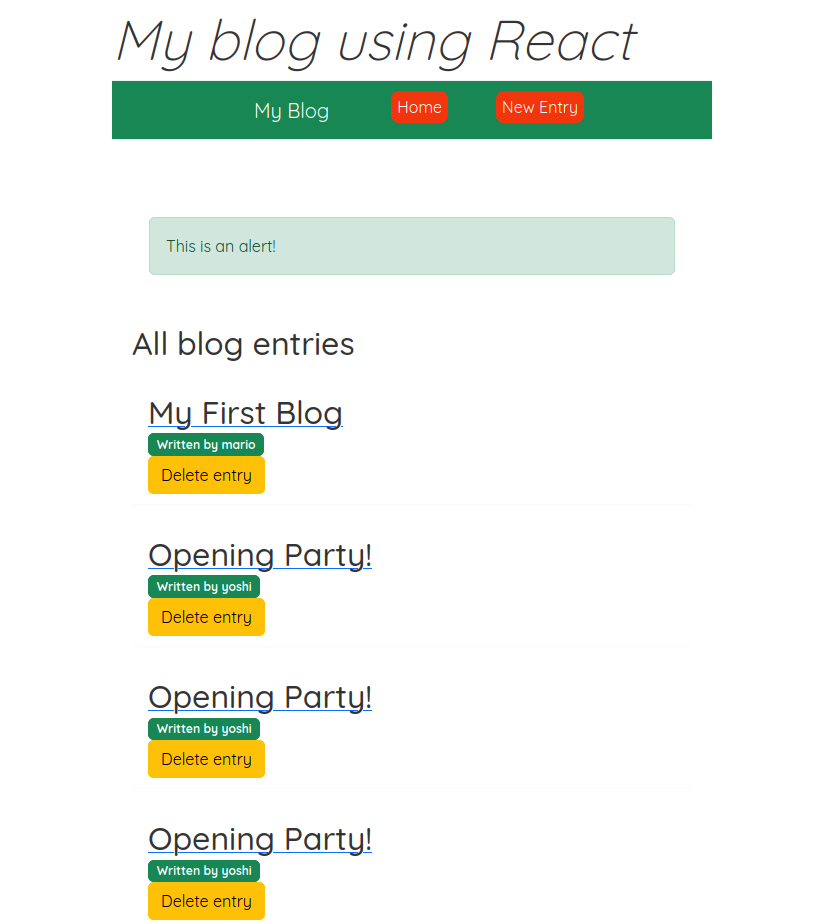

# Instructions of use

* Open VSCode (or a console window)
* Inside the directory of the BLOG, run:

### `npm run start`

* On a parallel console, run:
### `npx json-server --watch data/db.json --port 8000`

* Open [http://localhost:3000](http://localhost:3000) to view it in your browser.

# Visualization of the blog
